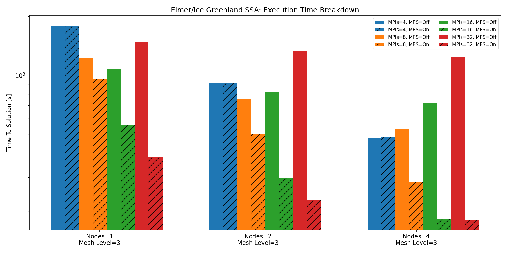
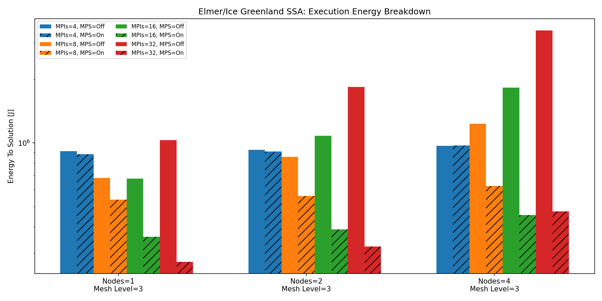
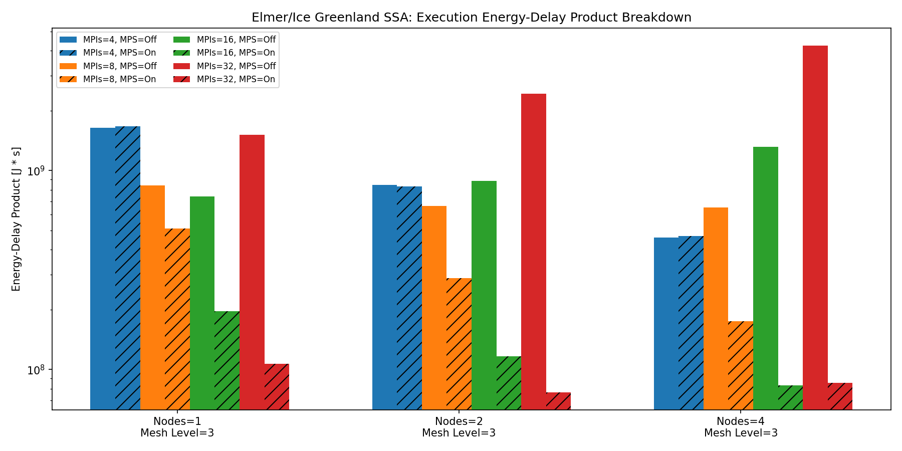
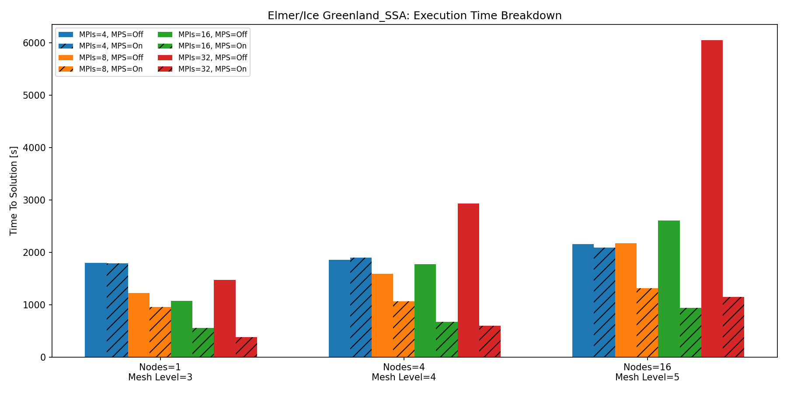
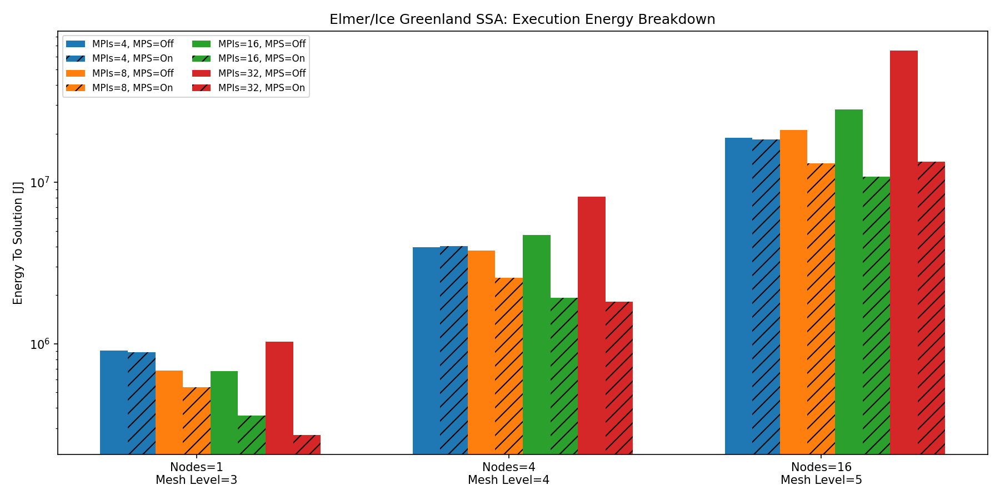
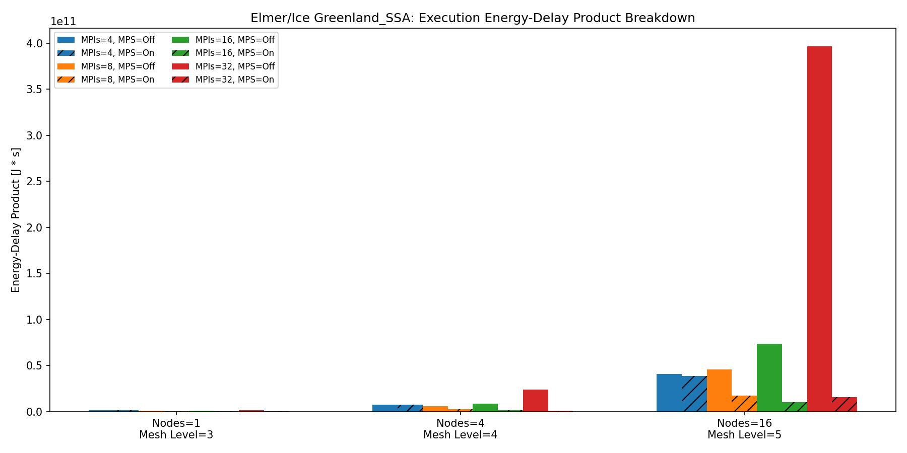

# Energy Optimization of Elmer/Ice with NVIDIA MPS

Elmer/Ice is an open-source code built on the Elmer platform [elmerfem](https://github.com/ElmerCSC/elmerfem).
It has been developed for simulating glaciers and ice sheets.

Here we consider the northern-greenland test case.
It is a shallow-shelf approximation (SSA) based example of a setup for an ice-sheet problem. 

Specifically, we want to see if the porting to NVIDIA AMGX [amgx](https://developer.nvidia.com/amgx) of the Elmer/Ice code can benefit from NVIDIA MPS [mps](https://docs.nvidia.com/deploy/mps/index.html).
The investigation considers both the Time To Solution (TTS) as well as Energy To Solution (ETS).

Energy measurements are performed using Cinemon.

Cinemon [cinemon](https://gitlab.hpc.cineca.it/waldo/cinemon-public) is a tool designed to monitor and measure energy consumption on CINECA systems. 
It provides fine-grained power sampling by leveraging hardware interfaces such as RAPL (for CPUs) and NVML (for NVIDIA GPUs).

The container definitions have been produced by means of HPC Container Maker [HPCCM](https://github.com/NVIDIA/hpc-container-maker)

- For the apptainer definition targetting Leonardo Booster (or in general `Intel x86_64` and `NVIDIA A100`) see `definitions/Elmer_ubuntu24_leonardo.def`

- For the apptainer definition targetting Thea (or in general NVIDIA Grace-Hopper architecture) see `definitions/Elmer_ubuntu24_thea.def`

# Results on Leonardo Booster

The results below refer to `ElmerCSC/elmerfem@9dce9c2ac192b50fd29f00bef746debac1a8018e` obtained on Leonardo Booster partition.

Leonardo Booster one-node configuration:

- Processors: single socket 32-core Intel Xeon Platinum 8358 CPU, 2.60GHz (Ice Lake)
- RAM: 512 GB DDR4 3200 MHz
- Accelerators: 4x NVIDIA custom Ampere A100 GPU 64GB HBM2e, NVLink 3.0 (200GB/s)
- Network: 2 x dual port HDR100 per node (400Gbps/node)
- All the nodes are interconnected through an Nvidia Mellanox network (Dragon Fly+).

First we consider the strong scalability of the Greenland SSA by considering a Mesh Level 3 problem, on 1, 2 and 4 Leonardo Booster nodes.
Specifically, for each resource allocation, we vary the number of MPI ranks per node, by considering:

- 4  tasks per node (corresponding to one MPI process per GPU)
- 8  tasks per node (corresponding to two MPI process per GPU)
- 16 tasks per node (corresponding to four MPI process per GPU)
- 32 tasks per node (corresponding to eight MPI process per GPU)

For each configuration, we measure the Time To Solution, Energy To Solution and Energy Delay Product (EDP) with NVIDIA MPS enabled.
As baseline, we consider the case without NVIDIA MPS.

The results are based on single runs, without statistical analysis, and are summarized in the plots below.

Next, we consider a weak scalability of the Greenland SSA by considering:
- a Mesh Level 3 problem on 1  Leonardo booster node
- a Mesh Level 4 problem on 4  Leonardo booster nodes
- a Mesh Level 5 problem on 16 Leonardo booster nodes

The results are summarized in the plots below:

The data can be found in `results/Leonardo/data.csv` produced using the scripts in `scripts/Leonardo` and analyzed using `analysis/plot.py`

As shown, running Elmer/Ice with the Greenland SSA test case on Leonardo Booster significantly benefits from NVIDIA MPS. 
Enabling MPS yields up to a 2x speedup in Time to Solution while also reducing the Energy to Solution by approximately half compared to the baseline configuration.

# Segmentation Fault with elmerfem most recent commit

The same scripts that produce the results above, crash with Segmentation Fault when running on a container with the most recent elmerfem commit:

- `ElmerCSC/elmerfem@7b073597d1c1df84367f1dfaa44972306643a311`

See `definitions/Elmer_ubuntu24_leonardo_most_recent.def` and `scripts/Leonardo_most_recent/run_Elmer_leonardo_N1_n4_c8_ML3_most_recent_39212184.err`
